# QuantumFlow IoT: Smart IoT Event Streaming. Scaling with Apache Kafka and MQTT 🌐📊

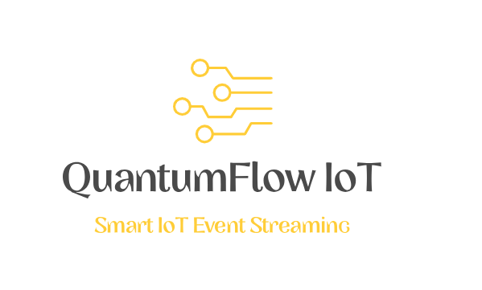

Unlock the potential of the Internet of Things (IoT) with this cutting-edge Event Streaming Architecture. Leveraging the power of Apache Kafka and MQTT, this project is designed to handle IoT data at scale. 🚀

Ingest real-time data from IoT sensors across diverse locations, analyze metrics like temperature, humidity, pressure, and luminosity, and store them efficiently in a high-performance MongoDB database. 🌡️💧📈

The technology stack includes Spring Boot, Kafka Streams, Micrometer, and Grafana for real-time monitoring, making this architecture a powerhouse for IoT solutions. 💻📈🔍

With Docker containerization, deployment is a breeze. Explore this project, visualize IoT data, and gain insights into your sensor networks. 🐳🚀📊

Check out the detailed [Medium article]([link_to_medium_article](https://medium.com/@sanchezsanchezsergio418/iot-event-streaming-architecture-fb790c634c2f)) for a comprehensive overview. 📖

Thank you for visiting the Smart IoT Event Streaming GitHub repository! Empower your IoT endeavors and scale with confidence. 🌐📈💡

Project developed to practice what I have learned in the Udemy course [Apache Kafka Series - Kafka Connect Hands-on Learning](https://www.udemy.com/course/kafka-connect/) and 
[Apache Kafka Series - Kafka Streams for Data Processing](https://www.udemy.com/course/kafka-streams/).

  
  
  
  
  
  
  

## Architecture Overview

The main goals of this architecture are the following:

* Ingest and store real-time data from IoT sensors located in various locations.
* Analyze and make aggregations through rotating time windows to know average temperature by sensor or place, in addition to humidity, pressure and luminosity.
* Store data after processing for subsequent monitoring in a NOSQL database with good performance for frequent writes for relatively homogeneous document sizes such as MongoDB.
* Visualization of the metrics of the sensors in real time and of the performance of the components of the architecture through Grafana and the consolidated documents in MongoDB through Mongo-Express.

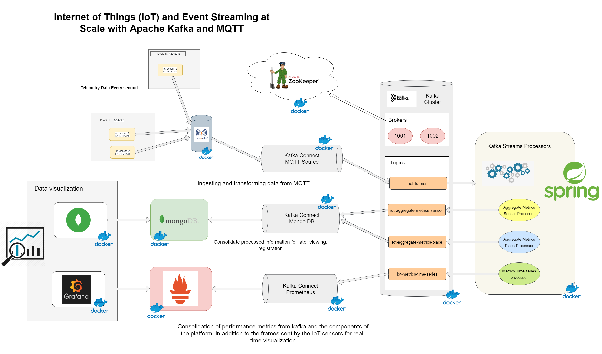

## Used technology

* Spring Boot 2.3.3 / Apache Maven 3.6.3.
* Spring Boot Starter Actuator.
* Kafka Streams.
* Spring Kafka.
* Micrometer Registry Prometheus.
* Eclipse Paho MQTT Client.
* Kafka Connect.
* Kafka Rest Proxy
* lombok.
* Jackson.
* NodeExporter (Exporter for machine metrics).
* Prometheus.
* Grafana.
* Eclipse Mosquitto.
* MongoDB.
* Mongo DB Express (Web-based MongoDB admin interface, written with Node.js and express).
* Cadvisor (Analyzes resource usage and performance characteristics of running containers).
* kafka-exporter (Kafka exporter for Prometheus).

## Running Applications as Docker containers.

### Rake Tasks

The available tasks are detailed below (rake --task)

| Task | Description |
| ------ | ------ |
| check_deployment_file_task | Check Deployment File |
| check_docker_task | Check Docker and Docker Compose Task |
| cleaning_environment_task | Cleaning Evironment Task |
| deploy | Deploys the IoT Event Streaming Architecture and laun... |
| login | Authenticating with existing credentials |
| start | Start Containers |
| status | Status Containers |
| stop | Stop Containers |
| undeploy | UnDeploy IoT Event Streaming Architecture |

To start the platform make sure you have Ruby installed, go to the root directory of the project and run the `rake deploy` task, this task will carry out a series of preliminary checks, discard images and volumes that are no longer necessary and also proceed to download all the images and the initialization of the containers.

  ### Containers Ports

| Container | Port |
| ------ | ------ |
| kafka-topics-ui | localhost:8081 |
| kafka-connect-ui | localhost:8082 |
| zoonavigator-web | localhost:8083 |
| mongo-express | localhost:8084 |
| grafana | localhost:8085 |
| prometheus | localhost:8086 |
| kafka-rest-proxy | localhost:9999 |

## Some screenshots

### Deploy with Docker Compose.

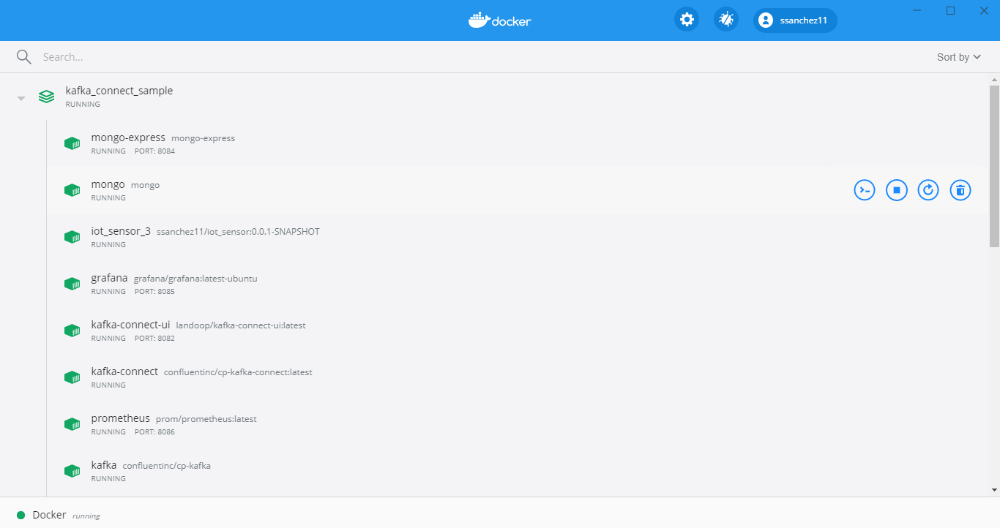

### Viewing topics through Landoop Kafka Topics UI

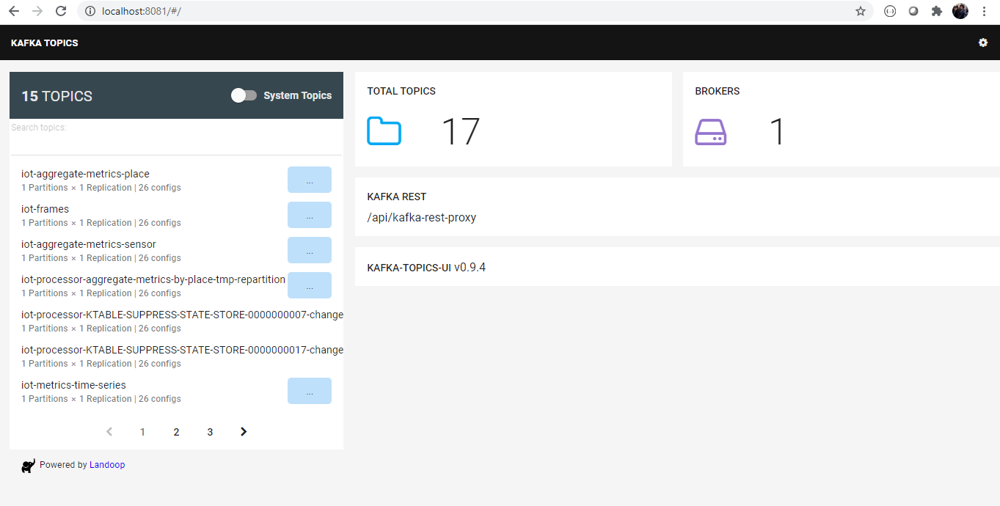
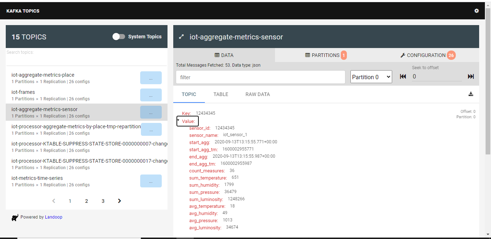

### Viewing Connect Topology through Landoop Kafka Connect UI

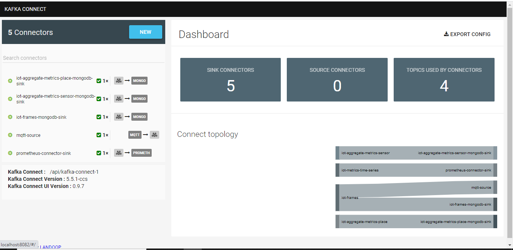
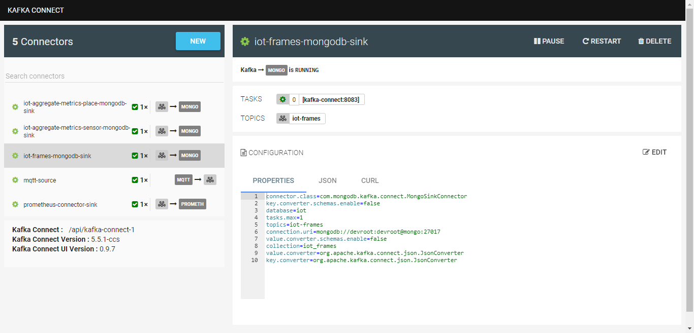

### Viewing Zookeeper Nodes through ZooNavigator

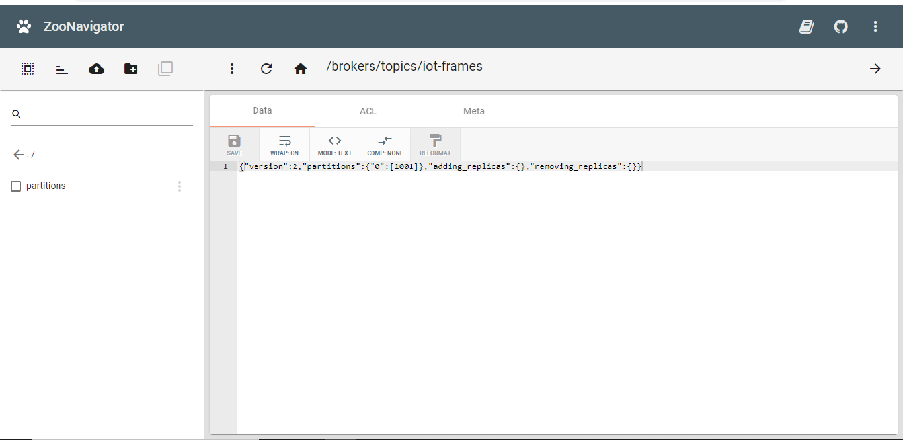

### Viewing information consolidated and processed in MongoDB through Mongo Express.

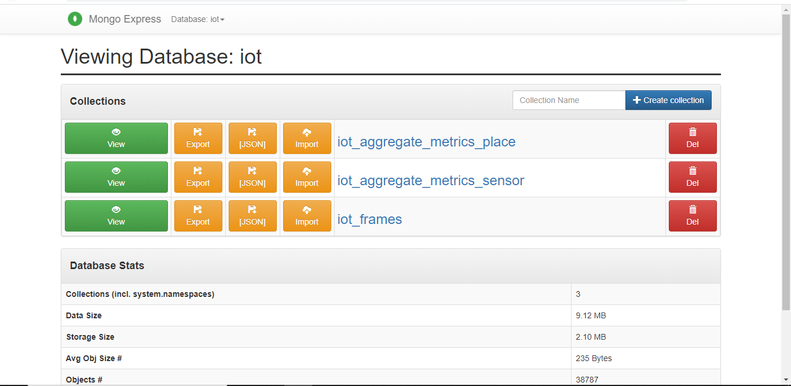
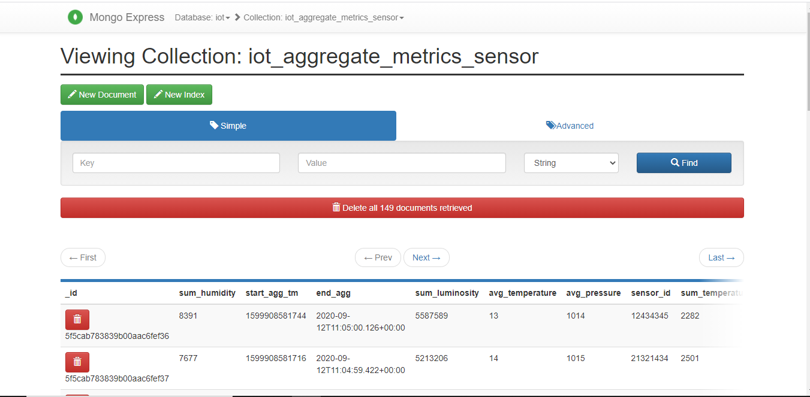
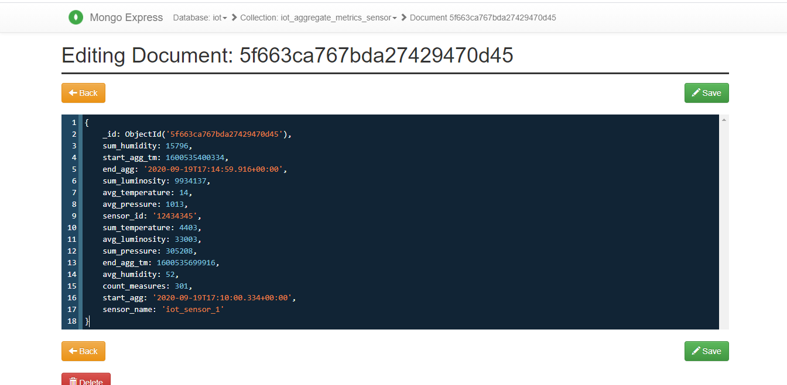

### Viewing the metrics of the IoT sensors simulated on the platform.

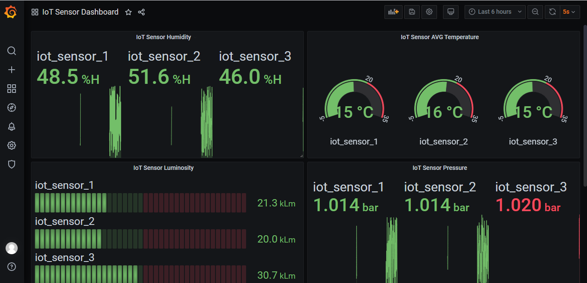
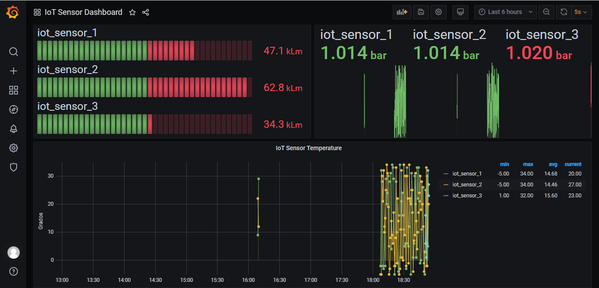

### Viewing metrics about Kafka's performance.
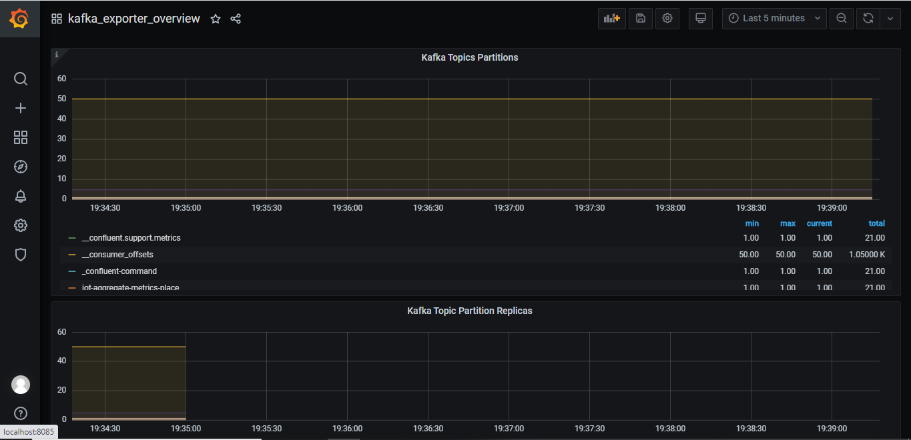

### Viewing platform container metrics.
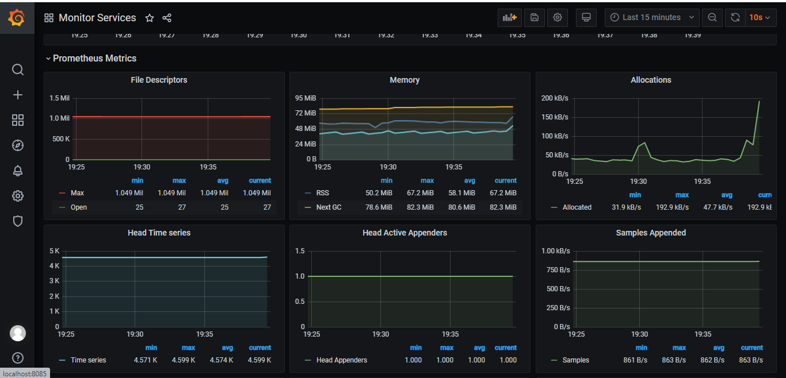

## Visitors Count

## Please Share & Star the repository to keep me motivated.
  
  

